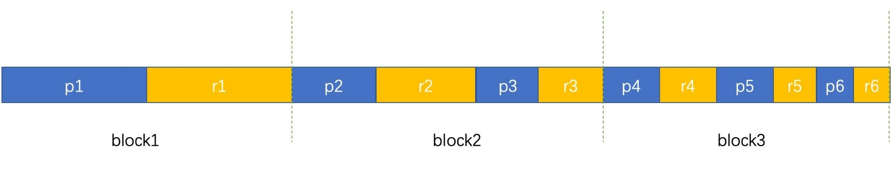

# 多样本Pack微调

## 使用场景

### 问题描述

由于计算资源紧缺，训练过程中加载的每个批次的样本长度不一，大部分的数据都需要在结尾padding到 `seq_length` 的长度，训练效率低，造成计算资源浪费；

### 特性介绍

多样本 Pack 的核心思想是将多个样本（如文本序列）打包成一个“Pack”，会将指定数据集中，不同长度的数据组合成指定长度，并尽可能地填充有效的数据内容。若拼接的数据无法达到指定的 `seq-length` 的长度，则该数据将会被 Pad 到指定的长度。因此，**每条Pack数据集的长度都一致**，从而减少训练过程中的样本数量，提高训练效率。

新样本是由多个初始样本合并而成，每个block是一个新的样本：



参与计算式的`attn_mask` 也改变成锯齿状的矩阵类型：


业界还有其他pack模式（下三角pack等），敬请期待支持。

## 使用方法

### 示例

接下来以[`Qwen2.5-7B的pack微调脚本`](../../examples/mcore/qwen25/tune_qwen25_7b_4k_full_pack.sh)使用Alpaca数据集微调为例

#### 数据预处理

指令微调数据集预处理脚本如下：

[`Qwen2.5-7B的pack场景下的数据预处理脚本`](../../examples/mcore/qwen25/data_convert_qwen25_instruction_pack.sh)


参数说明：

* `--pack`
	
	将数据转为Pack格式。

* `--neat-pack`

	是 Pack 场景下使用锯齿状的`attention_mask`参与计算的开关，其作用是调整数据集处理阶段生成的`attention_mask`，为训练阶段生成对应的`actual_seq_len`准备。

* `--seq-length`
	
	指定Pack数据集每条数据的长度。

*  `--append-eod`【可选参数】
	
	在每个输入序列的末尾添加一个特殊的标记来表示输入序列的结束。

* `--overwrite-cache`

	用于控制是否覆盖已存在的缓存分词器。

* `--input`

	可以直接输入到数据集目录或具体文件，如果是目录，则处理全部文件, 支持 .parquet \ .csv \ .json \ .jsonl \ .txt \ .arrow 格式， 同一个文件夹下的数据格式需要保持一致 

* `--map-keys`

	参数用于配置字段映射来使用数据集。


启动命令：

```shell
# mcore
# 命名及启动：examples/mcore/qwen25/data_convert_qwen25_instruction_pack.sh
bash examples/mcore/qwen25/data_convert_qwen25_instruction_pack.sh
 ```

指令微调数据集处理结果如下：

```shell
./finetune_dataset/alpaca_packed_attention_mask_document.bin
./finetune_dataset/alpaca_packed_attention_mask_document.idx
./finetune_dataset/alpaca_packed_input_ids_document.bin
./finetune_dataset/alpaca_packed_input_ids_document.idx
./finetune_dataset/alpaca_packed_labels_document.bin
./finetune_dataset/alpaca_packed_labels_document.idx
```

微调时，数据集路径输入 `./finetune_dataset/alpaca` 即可

> 可以使用任意的[**Alpaca风格数据**](alpaca_dataset.md)和[**ShareGPT风格数据**](sharegpt_dataset.md)的数据集


#### 微调脚本

指令微调脚本如下：

[`Qwen2.5-7B的pack微调脚本`](../../examples/mcore/qwen25/tune_qwen25_7b_4k_full_pack.sh)

填写相关路径：

* `DATA_PATH`
	
	指定数据预处理后的保存路径。

* `TOKENIZER_MODEL`

	指定模型的分词器路径（例如`tokenizer.model`）。

* `CKPT_LOAD_DIR`

	指向权重转换后保存的路径。

* `CKPT_SAVE_DIR`
	
	指向用户指定的微调后权重保存路径（例如指定保存到`ckpt`文件夹下）。

因此，根据之前的示例，路径应填写如下：

```bash
DATA_PATH="./finetune_dataset/alpaca"
CKPT_SAVE_DIR="./ckpt/"
TOKENIZER_MODEL="./model_from_hf/qwen25-7b-hf/"
CKPT_LOAD_DIR="./model_weights/qwen25-7b-mcore/"
```

微调相关参数说明：

* `--is-instruction-dataset`
	
	用于指定微调过程中采用指令微调数据集，以确保模型依据特定指令数据进行微调。

* `--prompt-type`

	用于指定模型模板，能够让base模型微调后能具备更好的对话能力。`prompt-type`的可选项可以在[`templates`](../../configs/finetune/templates.json)文件内查看。

* `--reset-position-ids`

	每条数据由不同的样本拼接而成，因此其位置 ID 并不连续。该参数用于为每条拼接的数据重置位置 ID，以确保在处理多个样本时，位置编码保持一致性。

* `--neat-pack`
	
	是Pack场景下使用锯齿状的`attention_mask`参与计算的开关，其作用是利用数据集处理阶段生成的`attention_mask`生成对应的`actual_seq_len`。

* `--padded-samples` 【可选参数】
	
	将样本总数凑成`batch-size`的整数倍。

* `--no-shuffle`【可选参数】
	
	数据顺序加载。

启动脚本：

```bash
bash examples/mcore/qwen25/tune_qwen25_7b_4k_full_pack.sh
```

> **更多模型支持Pack模式，请参考example目录使用**

### 使用影响

* Pack 模式受数据长度限制，如果初始样本的长度超过模型设定的最大序列长度，需要进行截断处理；如果初始样本长度过短，可能会导致 Pack 中包含过多样本，增加计算复杂度。

* 微调时选择 Pack 模式，可有效减少训练时迭代的样本数量，初始的短序列长度的样本被 Pack 成一个新的样本，可以有效减少计算资源的浪费，提高微调效率。

* 选择Pack模式进行微调时，由于输入的`inputs`，`lables`，`attn_mask`等数据流改变，训练的效果和精度也会随之改变，所以效果和精度对比时，两边都需要采用Pack模式进行微调。


## 使用约束

* 数据预处理时，使用 `--neat-pack` 参数的前提是必须使用 `--pack` 参数。

* 微调时，使用 `--neat-pack` 参数的前提是必须使用 `--reset-position-ids` 参数。
