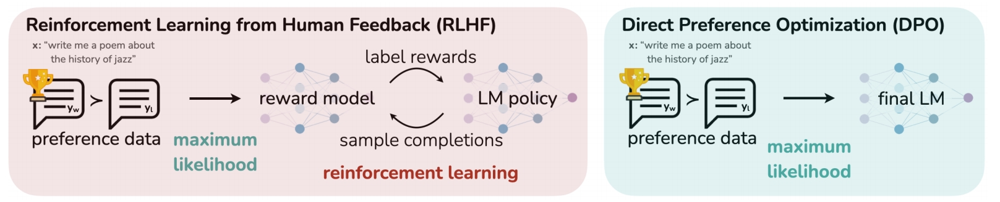
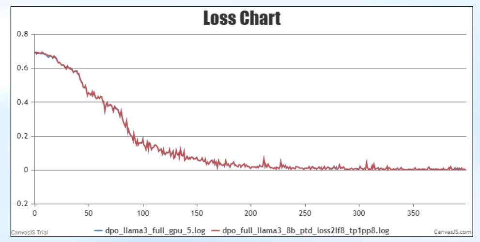

# 后训练方法DPO(直接偏好对齐)

直接偏好优化（Direct Preference Optimization，DPO）是一种用于优化大型语言模型（LLMs）的训练方法，其目的是通过人类偏好数据来调整模型参数。与PPO等其他复杂的RLHF方法需要在训练过程中更新多个模型相比，DPO在训练过程中只需要对policy一个模型进行参数更新，训练效率更高。



这里实现的是经典DPO算法，在训练过程中，不会使用policy-model进行推理并参与其权重更新，因此是offline的。

## 使用说明

### 数据预处理

dpo使用pairwise正负样本配对数据集，数据预处理命令如下：

```shell
python ./preprocess_data.py \
    --input ./dataset/orca_rlhf.jsonl \
    --tokenizer-type PretrainedFromHF \
    --tokenizer-not-use-fast \
    --tokenizer-name-or-path ./model_from_hf/Meta-Llama-3-8B-Instruct/ \
    --output-prefix ./pair_dataset/orca_rlhf_llama3 \
    --workers 4 \
    --log-interval 1000 \
    --handler-name AlpacaStylePairwiseHandler \
    --prompt-type llama3 \
    --map-keys '{"prompt":"question", "query":"", "system":"system"}'
```

更多关于pairwise数据集预处理说明见：[Pairwise-dataset](./pairwise_dataset.md ) 。

### 训练参数

dpo训练脚本参照：examples/mcore/llama3/dpo_llama3_8b_full_ptd.sh

相较于普通预训练，dpo需要增加一些几个参数：

- **`--stage`**

  必选，用于指定训练方法为dpo

- **`--is-pairwise-dataset`**

  必选，指定dpo使用pairwise配对数据集

- **`--dpo-loss-type `**

  可选参数，指定dpo计算loss方法，支持：sigmoid, hinge, ipo，默认sigmoid

- **`--dpo-beta`**

  可选参数，指定dpo计算loss中的参数，默认0.1

- **`--dpo-label-smoothing`**

  可选参数，dpo计算loss中的参数，取值范围0到0.5，默认0.0

- **`--pref-ftx`**

  可选参数，dpo计算loss中的参数，默认0.0

- **`--ref-model`**

  可选参数，指定参考模型路径， 默认为None，即与训练模型相同

- **`--refer-model-iter`**

  可选参数，指定参考模型初始权重的迭代步数，默认为1。在DPO的断点续训场景中指定此参数以区分续训时参考模型和训练模型导入的权重，训练模型将导入训练中断钱保存的权重，参考模型将导入refer_model_iter指定迭代步数的权重，以保证断点续训时导入的参考模型权重是初始的，而不是训练过的。

### DPO-LORA

dpo同样支持lora微调，跟普通lora微调一样，加上lora微调相关参数即可：

- **`--lora-r`** 
  LoRA rank，表示低秩矩阵的维度。较低的 rank 值模型在训练时会使用更少的参数更新，从而减少计算量和内存消耗。
- **`--lora-alpha`** 
  控制 LoRA 权重对原始权重的影响比例, 数值越高则影响越大。一般保持 `α/r` 为 2。

- **`--lora-target-modules`** 
  选择需要添加 LoRA 的模块，mcore 模型可选模块： `linear_qkv`, `linear_proj`, `linear_fc1`, `linear_fc2` 

- **`--lora-load`** 
  lora权重路径

### **MindSpeed-LLM  与 <a href="https://github.com/hiyouga/LLaMA-Factory/tree/main">DeepSpeed</a> loss 对比**：



## 参考文献

- [Direct Preference Optimization](https://export.arxiv.org/abs/2305.18290)