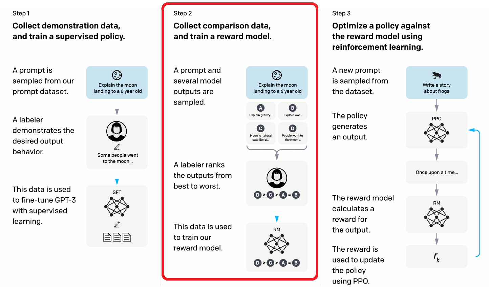
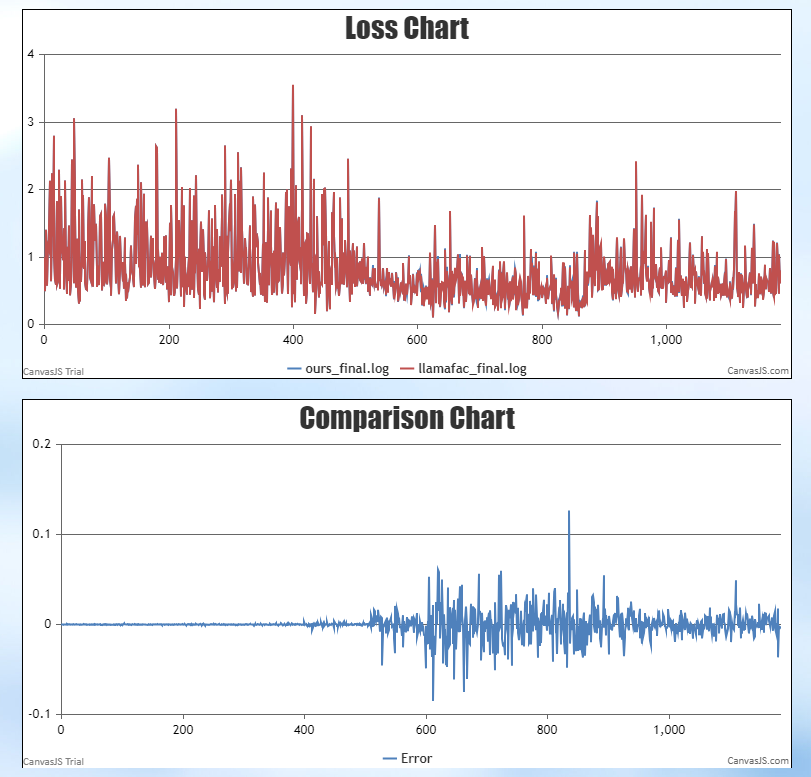

# 结果奖励模型训练

奖励模型（Reward Model）主要用于在基于人类反馈的强化学习（RLHF）过程中对大语言模型的回答进行评估，以使得模型生成的结果更加符合人类的喜好。结果奖励模型（Outcome Reward Model, ORM）仅对最终的结果进行评分，而不关注推理的过程。ORM 的输入是一个问题及回答，输出是该回答与问题匹配程度的评分。



ORM 训练使用 [Pairwise](./pairwise_dataset.md) 数据集，每条数据包含一个问题及配对的两条回答，一条是相对符合人类偏好的回答（chosen），一条是相对不符合人类偏好的回答（reject）。

ORM 结构以预训练模型为基础，将最后的 unembedding layer 替换为一个输出特征数为1的线性层 value head，将模型的输出映射为一个标量评分。

ORM 训练过程中，loss 采用以下公式计算得出：
$$
loss(\theta) = -E_{(x, y_c, y_r) \sim D} \log(\sigma(r_\theta(x, y_c) - r_\theta(x, y_r)))
$$
其中，$r_\theta(x,y)$ 表示 ORM 对该 “问题$x$-回答$y$” 的评分，$y_c$ 表示符合人类偏好的回答（chosen），$y_r$ 表示不符合人类偏好的回答（reject），$D$ 表示人工排序的 Pairwise 数据集。

## 使用说明

### 数据预处理示例

```shell
python ./preprocess_data.py \
    --input /data/dpo_en.json \
    --tokenizer-type PretrainedFromHF \
    --tokenizer-not-use-fast \
    --tokenizer-name-or-path /data/chatglm3-6b-base \
    --output-prefix dataset/dpo_en \
    --workers 4 \
    --log-interval 1000 \
    --handler-name SharegptStylePairwiseHandler \
    --prompt-type chatglm3 
```

注意 ORM 训练需要使用 Pairwise 数据集及对应的 Pairwise handler。更多关于 Pairwise 数据集预处理说明详见：[Pairwise-dataset](./pairwise_dataset.md)

### 训练脚本示例

目前仓上已包含 ChatGLM3-6B, Llama2-7B 奖励模型训练脚本。以 ChatGLM3-6B 为例，训练脚本参照：examples/mcore/chatglm3/reward_chatglm3_6B.sh

相较预训练，奖励模型训练需要额外配置以下参数：

- **`--stage rm`**

  指定进行奖励模型训练

- **`--is-pairwise-dataset`**

  必选，奖励模型训练需要使用 Pairwise 类型数据集

- **`--load-checkpoint-loosely`**

  可选，在已有的预训练模型基础上训练奖励模型，增加的 value head 部分权重需要随机初始化，需允许松弛加载

- **`--no-post-layer-norm`**

  可选，不使用模型最后的 layernorm 层

## **ModelLink  与 <a href="https://github.com/hiyouga/LLaMA-Factory/tree/main">LLaMA-Factory</a> loss 对比**：

数据集：dpo_en

训练参数设置：
```
per_device_train_batch_size: 1
gradient_accumulation_steps: 1
learning_rate: 1.0e-7
lr_scheduler_type: constant
fp32: true
```



## 参考文献

- [Training language models to follow instructions with human feedback](https://arxiv.org/abs/2203.02155)