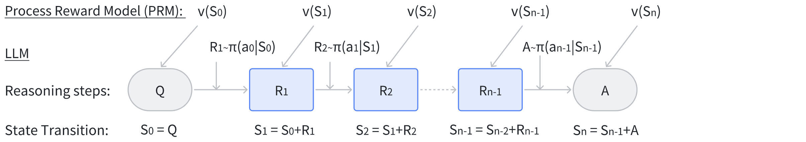

# MindSpeed-LLM 过程奖励模型（Process Reward Model）

## 过程奖励模型简介

过程奖励模型PRM（Process Reward Model）可以对推理过程中的每个推理步骤进行评分，逐步评估推理路径，识别可能出现的任何错误的特定位置来提供精确的反馈，这是强化学习和自动校正中有价值的信号。



## 过程奖励模型原理

过程奖励模型的核心思想是通过步骤级别的标注数据集，训练过程奖励模型来预测解决方案中每个中间步骤的正确性，基本原理如下：

$$
r_{s_i}=PRM([q,s_{1:i-1}], s_i)
$$
其中 $s_{1:i}=[s_1,...,s_i]$ 表解决方案 $s$ 中的第 $s_i$ 个步骤，这提供了比 ORM 更精确和更细粒度的反馈，因为它识别了错误的确切位置。

给定一个数学问题 $q$ 和对应的解决方案 $s$，PRM为 $s$ 的每个推理步骤 $s_i$ 分配一个分数，通常使用以下方式进行训练：

$$
{\mathcal L}_{PRM} = \sum\limits_{i=1}\limits^{K} y_{s_i} log r_{s_i} + (1-y_{s_i})log(1-r_{s_i})
$$

其中 $y_{s_i}$ 是步骤 $s_{i}$ 的标签，表示步骤 $s_{i}$ 是否正确；$r_{s_{i}}$ 是PRM为步骤 $s_{i}$ 的分配的sigmoid分数，$K$ 表示 $s$ 包含的推理步骤数。

## 过程奖励模型训练示例

在`1x8`的集群配置下，使用`Atlas 900 A2 PODc`进行全参数微调。**以LLaMA2-7B模型在TP1PP8切分后生成的权重作为输入，进行过程奖励模型训练示例。**

### 数据预处理

MATH-SHEPHERD 数据集下载及预处理可以参考 <a href="../../docs/features/process_reward_dataset.md">过程奖励数据预处理</a>。


**接下来将以MATH-SHEPHERD数据集作为输入，进行过程奖励模型训练示例。**

### 启动脚本

使用examples/mcore/llama2/模型目录下的<a href="../../examples/mcore/llama2/tune_llama2_7b_prm_full_ptd.sh">过程奖励模型微调脚本</a>。

#### 填写相关路径

`DATA_PATH`：指定数据预处理后的保存路径。

`TOKENIZER_MODEL`：指定模型的分词器路径（例如`tokenizer.model`）。

`CKPT_LOAD_DIR`：指向权重转换后保存的路径。

`CKPT_SAVE_DIR`：指向用户指定的微调后权重保存路径（例如指定保存到`ckpt`文件夹下）。

因此，根据之前的示例，路径应填写如下：
```bash
DATA_PATH="./prm_dataset/math-shepherd"
CKPT_SAVE_DIR="./ckpt/"
TOKENIZER_MODEL="./model_from_hf/llama-2-7b-hf/"
CKPT_LOAD_DIR="./model_weights/llama-2-7b-mcore/"
```

#### 指令微调相关参数

【--stage】

必选，用于指定训练方法为prm

【--placeholder-token】

微调数据prompt中每个推理步骤间的分割占位符，默认为"ки"。

【--reward-tokens】

微调数据label中表示每个推理步骤是否正确的奖励hard标签token，"+"代表当前推理步骤是正确的，"-"代表当前推理步骤是错误的。


#### 运行脚本

```bash
bash /examples/mcore/llama2/tune_llama2_7b_prm_full_ptd.sh
```


## 参考文献

[[1] Wang P, Li L, Shao Z, et al. Math-shepherd: Verify and reinforce llms step-by-step without human annotations[C]//Proceedings of the 62nd Annual Meeting of the Association for Computational Linguistics (Volume 1: Long Papers). 2024: 9426-9439.](https://arxiv.org/abs/2312.08935)

[[2] Wang J, Fang M, Wan Z, et al. OpenR: An Open Source Framework for Advanced Reasoning with Large Language Models[J]. arXiv preprint arXiv:2410.09671, 2024.](https://arxiv.org/pdf/2410.09671)