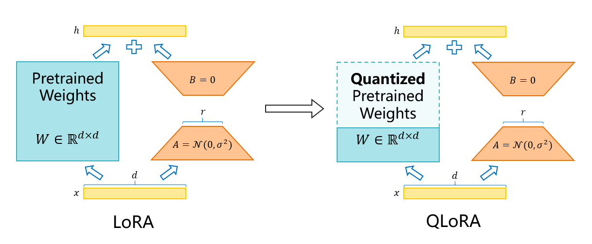

# QLoRA

## 特性介绍

### LoRA

模型中的线性层通常是将激活值$x$与权重矩阵的转置$W^T$进行矩阵乘运算，并加上$bias$：

$$
y = xW^T + bias
$$

矩阵的**秩**（Rank）揭示了这个矩阵的“信息量”，预训练模型中的这些线性层的权重矩阵通常是满秩的。

对于预训练的权重矩阵$W_0\in \mathbb{R}^{n\times m}$，可以认为它在微调阶段更新后变成了$W_0 + \Delta W = W_0 + AB$，其中$A\in \mathbb{R}^{n\times r}, B\in \mathbb{R}^{r\times m}$，那么矩阵$\Delta W = AB\in \mathbb{R}^{n\times m}$，且$rank(\Delta W)\in[0, min(n, m, r)]$，我们选取$r\ll min(n, m)$，所以$rank(\Delta W)\in[0, r]$。

这样冻结$W_0$部分权重，仅更新参数量极少的旁路矩阵$A,B$的训练是非常高效的，很大程度上减少了低秩矩阵中的冗余信息占用的空间和计算量。

在前向传播时，增加了LoRA的线性层（矩阵部分）变成了计算：

$$
y = xW_0^T + x A^T B^T
$$

反向传播的输入是Loss对当前层的输出 $y$ 的梯度 $\frac{\partial \mathcal{L}}{\partial y}$，需要更新旁路矩阵 $A, B$ 的参数，所以需要计算 $A, B$ 的梯度 $\frac{\partial \mathcal{L}}{\partial A}, \frac{\partial \mathcal{L}}{\partial B}$，仅对$A$或$B$求偏导可以将 $xW_0^T$ 看做常数项，这个过程不涉及$W_0$，但为了继续反向传播，当前层还需要返回 $\mathcal{L}$ 对输入的的梯度：

$$
\frac{\partial \mathcal{L}}{\partial x}=\frac{\partial \mathcal{L}}{\partial y} \frac{\partial y}{\partial x} = \frac{\partial \mathcal{L}}{\partial y} W_0 + \frac{\partial \mathcal{L}}{\partial y} BA
$$

因此，$W_0$的参数不需要更新，但是仍需要在前向和反向时各参与一次矩阵乘运算。

### QLoRA

#### 线性层量化

量化（Quantization）技术可以压缩模型大小的同时保持较高的精度，无校准集的仅权重量化可以使

$$
\phi \big(W - Q^{-1}(Q(W))\big)
$$

尽可能小，误差在可以接受的范围内，其中$W$表示浮点权重，$Q(*)$和$Q^{-1}(*)$分别代表量化和反量化函数，$\phi$代表某种损失函数比如平均绝对误差等。

我们使用**NF4量化**来进行权重量化，这也是开源社区流行的QLoRA量化方式，该量化算法被实现在[bitsandbytes](https://github.com/bitsandbytes-foundation/bitsandbytes)，它在开源社区广受欢迎。

> 我们已经将支持NPU硬件的NF4量化功能贡献到bitsandbytes多硬件后端重构分支，但由于bitsandbytes官方还未正式将该分支在PyPi上发布，本仓库暂使用NPU版本的bitsandbytes，可以通过`pip install bitsandbytes-npu-beta`来安装。

NF4是一种查找表量化，NF4表接近高斯分布下的数据的最佳表示方式，我们可以在QLoRA微调前先对权重$W_0$进行量化：

$$
W_0^{NF4} = Q(W_0)
$$

然后在微调阶段每次需要$W_0$参与运算时对其进行反量化，即在前向传播中计算：

$$
y = x\big(Q^{-1}(W_0^{NF4})\big)^T + x A^T B^T
$$

在反向传播中计算：

$$
\frac{\partial \mathcal{L}}{\partial x} = \frac{\partial \mathcal{L}}{\partial y} Q^{-1}(W_0^{NF4}) + \frac{\partial \mathcal{L}}{\partial y} BA
$$

QLoRA在LoRA的基础上，对主干部分的权重进行量化，大幅降低了LoRA微调时的显存占用。

## 使用方法

1、将hf权重转换为mcore权重时，增加`--qlora-nf4`选项开启QLoRA的NF4量化，目前不支持其它量化方式；

2、在微调时，增加`--qlora`使用QLoRA微调，开启时请确保配置的权重路径是NF4量化后的mcore权重。

## 使用效果

由于仅对线性层的权重矩阵进行量化，激活值、梯度、优化器状态等仍然保持原精度，因此使用QLoRA可以给整体带来的内存收益比例会受到batch size、数据序列长度等因素的影响。

作为参考，我们在Llama-2-70b和Mixtral-8x7b上进行量化测试：

| 模型         | 原始权重大小 | NF4量化后权重大小 | 节省内存 |
| ------------ | ------------ | ----------------- | -------- |
| Llama-2-70b  | 129GB        | 35GB              | 94GB     |
| Mixtral-8x7b | 87GB         | 24GB              | 63GB     |

均可使用64GB单卡进行QLoRA微调，实测Llama-2-70b单batch微调过程中NPU内存占用约50GB左右。

> QLoRA支持分布式LoRA、lora-fusion、PP、TP等LoRA支持的特性，并且精度正常，更多特性的亲和性还在补充验证中。
