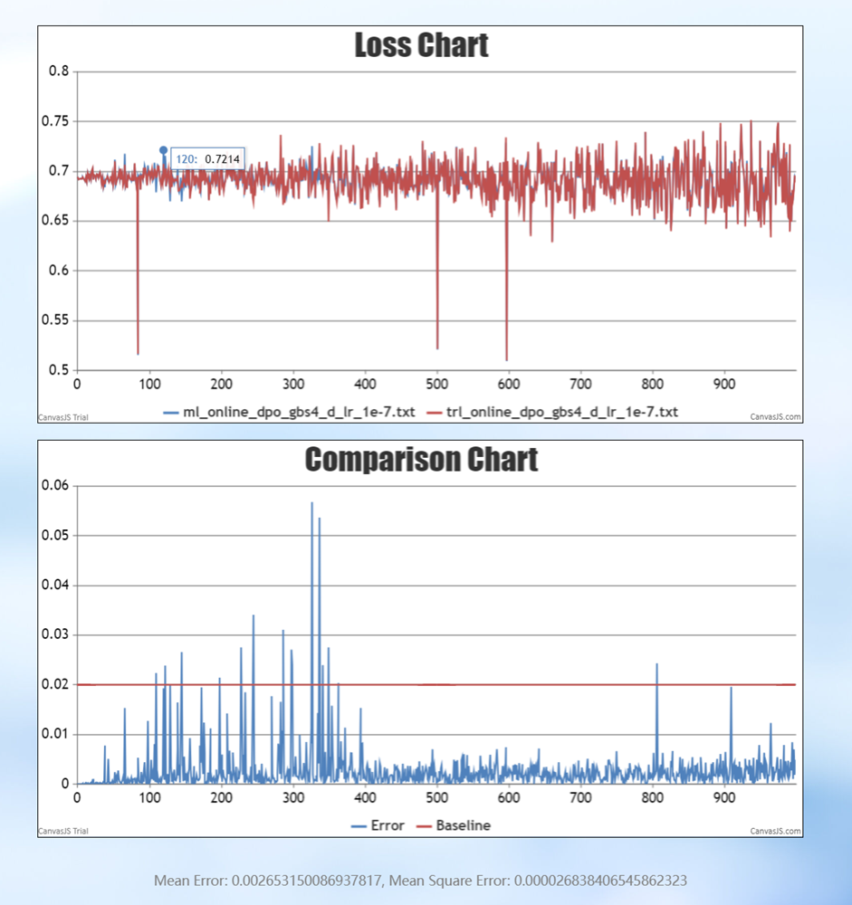

# 后训练方法 Ray Online DPO

Online Direct Preference Optimization (Online DPO) 是 Direct Preference Optimization (DPO) 的一种扩展或变体，旨在通过 在线学习 的方式进一步优化大型语言模型（LLMs）。DPO 是一种基于人类偏好数据的训练方法，而 Online DPO 则专注于在 动态、实时 的环境中使用偏好数据来持续改进模型。

Online DPO方法中包含了三个模型：Actor，Reference，Reward。其中Actor/Reference模型是经过预训练和指令微调（Supervised Fine-Tuning，SFT）得到的大语言模型，Reward是训练得到的奖励模型。Online DPO 的训练目标是使得 Actor 模型的回答可以更加符合人类偏好。

# 使用说明

## 环境配置

配置MindSpeed-LLM基础环境: 参考[安装指南](./install_guide.md)

## 数据预处理

数据集转换参考脚本：MindSpeed-LLM/examples/mcore/llama3/data_convert_llama3_ppo.sh
以 [descriptiveness 数据集](https://huggingface.co/datasets/trl-internal-testing/descriptiveness-sentiment-trl-style/tree/main/data) 为例。

```bash
source /usr/local/Ascend/ascend-toolkit/set_env.sh
mkdir ./dataset/llama3-hf/

python ./preprocess_data.py \
    --input ./dataset/descriptiveness-00000-of-00001.parquet \
    --tokenizer-name-or-path ./model_from_hf/llama3-hf/ \
    --output-prefix ./dataset/llama3-hf/descriptiveness \
    --workers 16 \
    --log-interval 1000 \
    --tokenizer-type PretrainedFromHF \
    --handler-name  PPOAlpacaStyleInstructionHandler \
    --prompt-type llama3 \
    --map-keys '{"prompt":"prompt", "query":"", "response": "prompt", "system":""}'
```

## 模型权重转换

根据 Online DPO 算法要求，Actor 和 Reference 模型应该使用 SFT 微调后的模型进行初始化，Critic 和 Reward 模型应该使用奖励模型训练后的模型进行初始化。PPO算法模型权重均使用Megatron-mcore格式，其他格式的权重需要进行模型权重转换，具体可参考[权重转换](./checkpoint.md)。

## 启动方式

### 单机

通过 --config-name 传递选取的 config 文件名（不添加.yaml后缀），可以通过下列命令直接启动训练（Llama32 1B 模型可单机运行）。
目前已支持的配置文件放置在 configs/rlxf/ 文件夹下。配置文件的具体说明见下文。

```bash
python ray_gpt.py --config-name online_dpo_trainer_llama32_1b
```

### 多机

多机运行程序时，需要首先进入对应目录，并激活conda或docker环境：

```bash
cd MindSpeed-LLM
conda activate xxx
```

然后，在主节点上启动 Ray 集群：

```bash
# 创建一个集群，端口6344，dashboard端口8260，有8个NPU
ray start --head --port 6344 --dashboard-host=0.0.0.0 --dashboard-port=8260 --resources='{"NPU": 8}'
```

随后，在其他节点加入主节点的集群

```bash
# IP_ADDRESS 处填写主节点 IP 地址
ray start --address="IP_ADDRESS:6344" --resources='{"NPU": 8}'
```

在完成 Ray 集群构建后，在主节点启动运行程序即可（Llama3 8B 模型可双机运行）

```bash
python ray_gpt.py --config-name online_dpo_trainer_llama3_8b
```

## 配置文件

由于 Online DPO 训练过程中涉及 3 个模型，通过将模型参数和训练配置解耦的层级化参数配置，来简化 Online DPO  训练的参数配置过程。RLXF 训练涉及到的所有配置文件均存储在 configs/rlxf 路径下，其中 model 文件夹下存储了模型结构相关的配置文件，Online DPO训练相关的模型参数文件以online_dpo_trainer_{模型名}.yaml方式命名。

在每个 online_dpo_trainer 配置文件中，需要包含defaults，training，resource_pool，algorithm等字段，以及  Online DPO 训练过程中涉及到的 3 个角色 actor，reward，ref的配置。其中：

1. defaults 负责引入模型配置文件，在 defaults 中应列举本配置文件中所需要用到的所有模型配置，模型配置可以在下方3个角色的具体配置中通过 model 字段进行选择。
2. training 字段设置的参数为所有 3 个角色通用的默认参数，这些参数可以在下方进一步被角色的单独配置所覆盖。
3. resource_pool 字段指定了各个角色所需的 NPU 资源数量。
4. actor，reward，ref 字段分别指定了Online DPO算法中三个角色训练相关的参数配置。

## 参数解析

相较于普通模型训练，PPO增加一些特殊参数：

### `training:`

* `stage`：用于指定训练算法，使用 Ray Online DPO 训练须设置为`ray_online_dpo`;

### `actor_rollout:`

* `do_sample`：控制 Actor 模型进行推理时是否采样，默认为 False，Online DPO 需要设置为True ；
* `ppo_mini_batch_size`：Actor 模型的 mini_batch_size，默认为1；
* `max_prompt_length`：PPO 训练中最大 prompt 长度，默认为512；
* `num_samples_per_step`：Actor 推理时每个step的推理样本数量，默认为1；
* `ppo_epochs`：Actor 训练对同一批经验数据的重复次数，默认为1；
* `clip_ratio`：Actor模型训练计算损失函数时的clip比例，默认为0.2；
* `shuffle_minibatch`：Actor 训练时是否对 minibatch 进行 shuffle，默认为 False；
* `num_gpus_for_train` ：Actor 模型分配给训练部分的显卡数量；
* `num_gpus_for_infer` ：Actor 模型分配给推理部分的显卡数量；
* `missing_eos_penalty`：缺少序列结束符EOS时的惩罚系数；

### `resource_pool:`

* `actor_rollout`：给 Actor 模型训练和推理总共分配的显卡数量；
* `ref`：给 Reference 模型分配的显卡数量；
* `reward`：给 Reward 模型分配的显卡数量；

# 精度对比

我们与 HuggingFace 的强化学习开源仓库 [TRL](https://github.com/huggingface/trl/) 进行了精度对比，来辅助验证算法实现的正确性。因为 Online DPO 1Q2A的特性需求，推理状态do sample 设置为 True，为了与基准方法进行精度对齐，在 Actor 推理时固定 responses 方式进行精度对齐的实验。可以看到，固定 responses 后 loss 能够较好地实现对齐。



