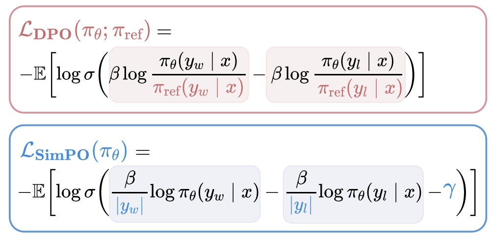

# 后训练方法SimPO(简单偏好对齐)

简单偏好优化（Simple Preference Optimization，SimPO）是一种用于优化大型语言模型（LLMs）的训练方法，与[DPO](./offline_dpo.md)一样，其目的是通过人类偏好数据来调整模型参数。与DPO相比，SimPO通过利用序列平均对数概率作为隐式奖励，对DPO的loss损失函数做了优化改进，从而去掉了参考模型，在训练过程中只有一个模型参与，因此可以进一步提升训练效率。



## 使用说明

### 数据预处理

simpo使用pairwise正负样本配对数据集，数据预处理命令如下：

```shell
python ./preprocess_data.py \
    --input ./dataset/orca_rlhf.jsonl \
    --tokenizer-type PretrainedFromHF \
    --tokenizer-not-use-fast \
    --tokenizer-name-or-path ./model_from_hf/Meta-Llama-3-8B-Instruct/ \
    --output-prefix ./pair_dataset/orca_rlhf_llama3 \
    --workers 4 \
    --log-interval 1000 \
    --handler-name AlpacaStylePairwiseHandler \
    --prompt-type llama3 \
    --map-keys '{"prompt":"question", "query":"", "system":"system"}'
```

更多关于pairwise数据集说明见：[pairwise-dataset](./pairwise_dataset.md ) 。

### 训练参数

simpo训练脚本参照：examples/mcore/llama31/simpo_llama31_8b_8k_ptd.sh

相较于普通预训练，simpo需要增加一些几个参数：

- **`--stage`**

  必选，用于指定训练方法为simpo

-  **`--is-pairwise-dataset`**

  必选，指定simpo使用pairwise配对数据集

- **`--simpo-loss-type `**

  可选参数，指定simpo计算loss方法，支持：sigmoid, hinge, ipo，默认sigmoid

- **`--simpo-beta`**

  可选参数，指定simpo计算loss中的参数，默认2.5

- **`--gamma-beta-ratio`**

  可选参数，指定simpo计算loss中的参数，默认1.4

- **`--simpo-label-smoothing`**

  可选参数，simpo计算loss中的参数，默认0.0

- **`--pref-ftx`**

  可选参数，simpo计算loss中的参数，默认0.0


### SimPO-LORA

与dpo一样，simpo同样支持lora微调，跟普通lora微调一样，加上lora微调相关参数即可，参数说明可参考[DPO](./offline_dpo.md)

## 参考文献

- [**Simple Preference Optimization**](https://export.arxiv.org/abs/2405.14734v2)