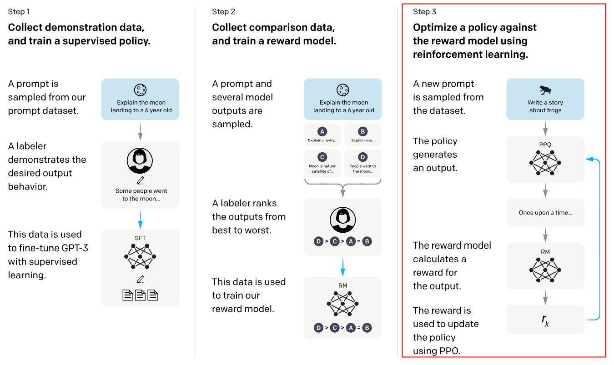

# Trl PPO算法
Trl PPO实现参考[huggingface/trl](https://github.com/huggingface/trl)库的PPO进行实现。  
PPO（Proximal Policy Optimization）是一种强化学习算法，它通过引入奖励信号来调整模型的行为，使模型生成的内容更符合人类的偏好。位于RLHF整个系统中的第3阶段。



Trl PPO算法涉及4个模型：actor模型、reference模型、reward模型、critic模型。其中actor模型和critic模型训练中会更新。actor模型和reference模型初始由RLHF第一阶段sft训练产生，reward模型和critic模型初始由RLHF第二阶段reward训练产生。
Trl PPO输入数据仅需要prompt，response由actor模型在线产生。

## 使用说明

### 数据预处理示例

```shell
python ./preprocess_data.py \
    --input ./dataset/train-00000-of-00001-a09b74b3ef9c3b56.parquet \
    --tokenizer-name-or-path ./model_from_hf/Llama-3.2-1B-Instruct \
    --output-prefix ./finetune_dataset/llama-3.2-1b-trl/alpaca \
    --workers 16 \
    --log-interval 1000 \
    --tokenizer-type PretrainedFromHF \
    --handler-name PPOAlpacaStyleInstructionHandler  \
    --prompt-type empty
```


### 训练脚本示例

目前仓上已包含 Llama3.2-1B trl_ppo训练脚本。以 Llama3.2-1B 为例，训练脚本参照：examples/mcore/llama32/trl_ppo_llama32_1b.sh

相较预训练，Trl PPO训练需要额外配置以下参数：

- **`--stage trl_ppo`**

  指定进行PPO训练

- **`--ref-model`**

  必选，reference模型和actor模型的路径

- **`--reward-model`**

  必选，reward模型和critic模型的路径

- **`--kl-coef`**

  可选，计算优势函数值时的KL散度系数， 默认0.3

- **`--gamma`**

  可选，计算优势函数值时的Discount factor， 默认1.0

- **`--lam`**

  可选，计算优势函数值时的Lambda value， 默认0.95

- **`--clip-ratio`**

  可选，actor loss的裁剪幅度， 默认0.2

- **`--cliprange-value`**

  可选，critic loss的裁剪幅度， 默认0.2

- **`--max-length`**

  可选，prompt+response的最长长度， 默认256

- **`--max-new-tokens`**

  可选，最大response生成长度， 默认128

- **`--do-sample`**

  可选，生成样本时采用采样选择或贪婪选择token， 默认贪婪选择

## Trl PPO 流程


## 日志说明
单个iteration 输出两个模型的训练日志，第一行是actor模型信息，第二行是critic模型信息

actor 日志说明:
- 1.pg_loss: policy gradient loss即是actor模型训练loss 
- 2.abs_pg_loss: absolute policy gradient loss  即 取每个token的policy gradient loss的绝对值来求平均，观测时使用。
- 3.ppo_ratio: 新policy的action分布与旧policy的action分布的比值
- 4.ppo_ratio_clamped: 新policy的action分布与旧policy的action分布的截断比值

critic 日志说明:
- 1.vf_loss: value function loss 即是 critic 模型训练loss

## 目前局限

- 1、4模型只支持同类同参数模型 
- 2、不支持cp、vpp 
- 3、4模型tp、pp、dp、ep需一致 
- 4、ppo_epoch未支持 
- 5、val/test数据集评估未支持

该版本为demo版本，待进一步功能完善。  

## **MindSpeed-LLM  与 <a href="https://github.com/huggingface/trl">trl</a> loss 对比**：

数据集：alpaca

训练参数设置：
```
per_device_train_batch_size: 1
gradient_accumulation_steps: 1
learning_rate: 1.0e-7
lr_scheduler_type: constant
fp32: true
```

loss对比方法：
- 由于trl实现中，对advantages做了masked_whiten操作，导致pg_loss均值在0附近，故观测abs_pg_loss进行对比。


## 参考文献

- [Proximal Policy Optimization Algorithms](https://arxiv.org/abs/1707.06347)