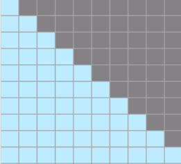
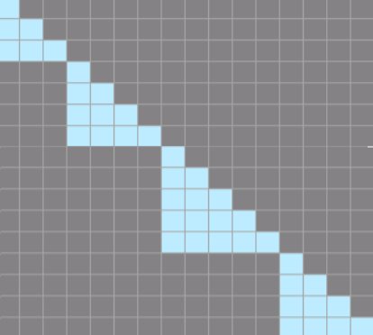

# 支持variable length flash attention训练场景

## 训练场景
通常一个批次中输入进模型的文本序列是由多个文档（doc）拼接得到。在默认情况下，多个文档被视为同一序列，互相间的self attention没有掩盖。在特定情况下，多个文档间要求独立，文档间不能互相做self attention，在这种情况下attention mask和position ids需要在每个文档结束的位置（EOD）被重新设置。

## 解决方案
通过调用底层flash-attention算子的可变长模式，支持当前训练场景。

## 使用方式

### 1. 数据准备
首先确保每一个文档的末尾都添加了EOD Token。

```bash
python ./preprocess_data.py \
   --input ./dataset/train-00000-of-00001-a09b74b3ef9c3b56.parquet \
   --tokenizer-name-or-path ./model_from_hf/Llama3-hf/ \
   --output-prefix ./dataset/enwiki \
   --workers 4 \
   --log-interval 1000  \
   --append-eod \ #使能TND必须增加eod
   --tokenizer-type PretrainedFromHF
```

### 2. 训练参数设置
在模型训练脚本中增加 `--reset-position-ids`

使能之后，会根据eod位置，生成变量actual_seq_len，标识多个文档（doc）拼接的实际长度。

## 原理
### 1.使能前
初始化atten_mask为压缩下三角矩阵（2048*2048）；



多个文档被视为同一序列，互相间的self attention没有掩盖，所有token均参与计算。
### 2.使能后

不初始化mask，根据eod位置生成actual_seq_len,假设一个序列中真实的文本长度分别为[2,2,0,2,2]，则actual_seq_len为[2,4,4,6,8]；
实际计算量由actual_seq_len决定；

类似的attn_mask可以类似的表示为（实际计算时不生成）：



其中左下角空白位置不参与计算。