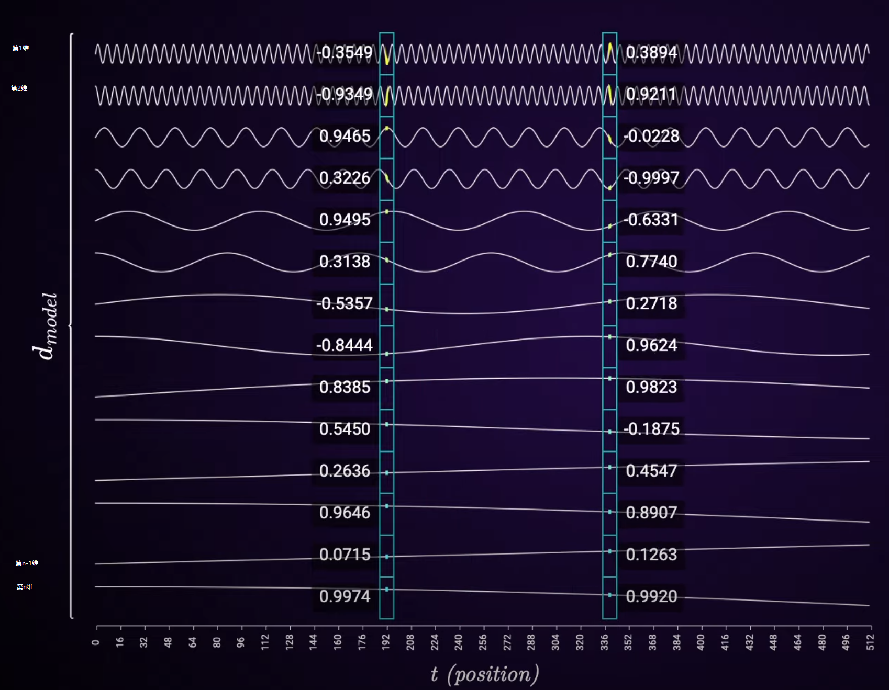
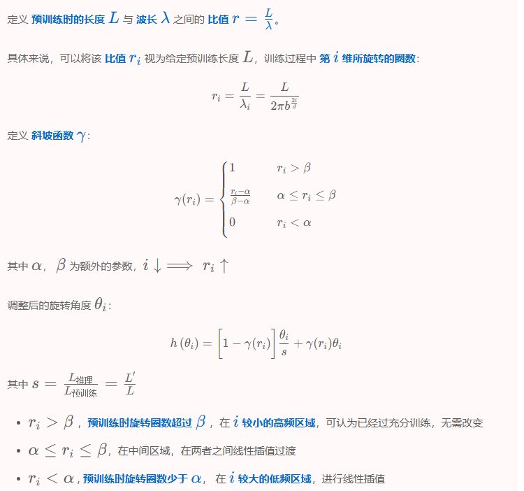

# yarn

## 特性介绍

基于Transformer的大语言模型已成为众多自然语言处理任务几乎普遍的选择，在这些任务中，诸如上下文学习等长距离处理能力至关重要。在执行自然语言处理任务时，预训练大语言模型的主要限制之一，是由其训练过程所决定的序列最大长度（上下文窗口）。传统的Transformer模型的计算和内存复杂度是O(n^2)，其中n为序列长度，随着序列长度增加，计算和内存消耗会急剧上升。通过少量微调（或无需微调）动态扩展上下文窗口的相关技术就变得非常重要。

yarn通过ntk-by-part调整位置编码，提升序列扩增后的精度。

如图所示，对于一个token的embedding，从低维到高维，旋转位置编码θ逐渐变大（频率逐渐变低），较低频的周期数不到1，较低频的周期数远超过1，对于高频部分直接外推，对于低频部分线性插值，中间区域，在两者之间进行线性插值过渡

## 使用方法

使用RoPE作为位置编码的模型，在推理时均可使用yarn来扩展上下文长度，以下用deepseek v2的配置举例

在deepseek v2系列上，通过--rope-scaling-type yarn进行使能，其它配置参数如下：

--rope-scaling-beta-fast  （高频旋转周期数，默认值32）

--rope-scaling-beta-slow  （低频旋转周期数，默认值1）

--rope-scaling-factor      (上下文扩展倍数, 高频维度外推时用到，比如预训练模型为4K，扩展上下文到160K长度，扩展倍数为40)

--rope-scaling-mscale      (注意力缩放系数函数yarn_get_mscale的入参)

--rope-scaling-mscale-all-dim (注意力缩放系数函数yarn_get_mscale的入参）

--rope-scaling-original-max-position-embeddings  （预训练模型未扩展时的上下文长度）

## 使用效果

使用deepseekv2系列的yarn默认配置，mmlu精度测试如下

| 模型                   | 任务     | MindSpeed-LLM | 社区                                                                    |
|----------------------|--------|-----------|-----------------------------------------------------------------------|
| DeepSeek-V2-Lite-16B | MMLU   | 57.4%     | [58.3%](https://huggingface.co/deepseek-ai/DeepSeek-V2-Lite)          |
| DeepSeek-Math-7B     |MMLU-STEM| 56.5%    | [56.5%](https://github.com/deepseek-ai/DeepSeek-Math)          |
| DeepSeek-V2-236B     | MMLU   | 78.1%         | [78.5%](https://huggingface.co/deepseek-ai/DeepSeek-V2)          |
| DeepSeek-V2.5        | MMLU   | 79.3%         | [80.6%](https://github.com/deepseek-ai/DeepSeek-V3)          |

