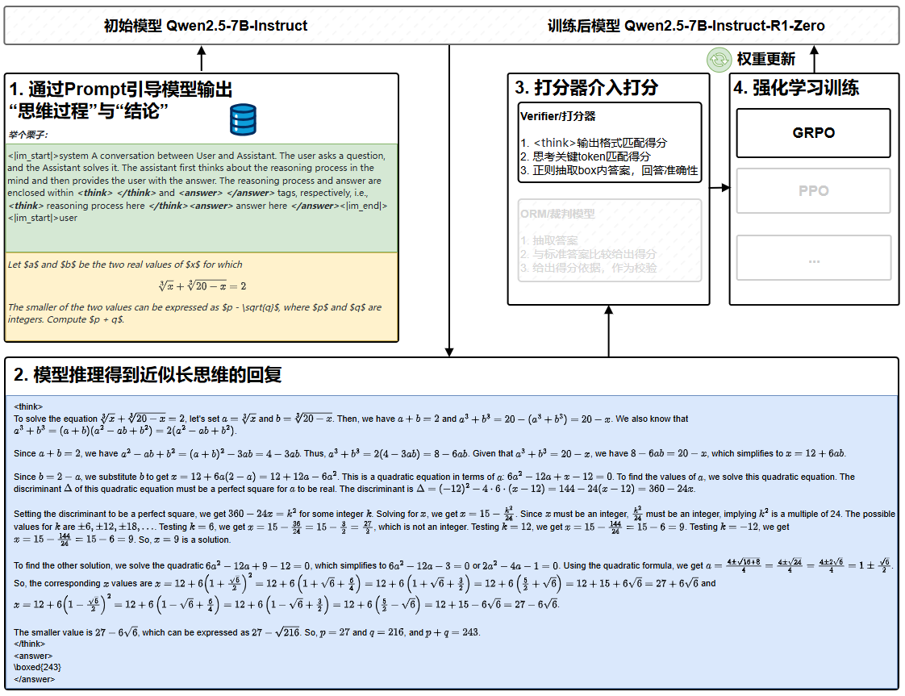
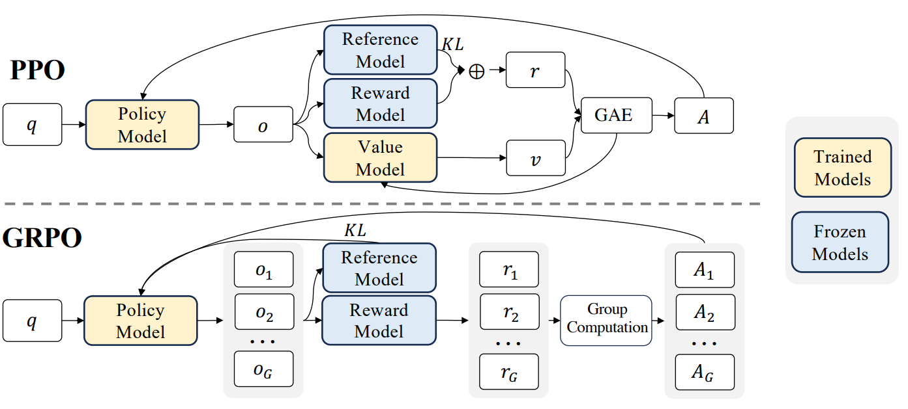

# DeepSeek-R1-Zero(qwen)
该特性是基于GPRO+ORM基础上扩展打分器进行混合打分而来，可用于复现DeepSeek-R1-Zero的工作

## 整体流程示意图



## **模型**

##### 模型选择
* Qwen2.5-Math-7B
我们先尝试了该模型，发现模型在初始prompt上对数学类问题的回复存在代码文字混用，中英文混杂的情况；当加了回复格式的约束指令后，没法引导出模型按`<think></think><answer></answer>`格式回复，且回复变得容易重复且难以读懂
* Qwen2.5-7B-Instruct
该模型指令遵从度高，有一定概率能引导模型输出`<think>...</think><answer>...$\boxed{}</answer>`格式回复

为了模型达到更好的效果，我们以下以Qwen2.5-7B-Instruct为例

##### 权重转换
同MindSpeed-LLM仓一样，模型需要从HuggingFace权重转换为MindSpeed权重，可参考[**这里**](../../../docs/features/checkpoint.md)


## 模板构造
R1-Zero是基于一个base模型训练而来，由于其基底模型本身并没有激发长思维的能力，因此我们
需要根据选择的模型进行调试，编写prompt模板以激发`<think>...</think><answer>...$\boxed{}</answer>`，以Qwen2.5-7B-Instruct为例：

```
<|im_start|>system\nYou are a helpful assistant.<|im_end|>\n<|im_start|>user\nA conversation between User and Assistant. The user asks a question, and the Assistant solves it. The assistant first thinks about the reasoning process in the mind and then provides the user with the answer. The reasoning process and answer are enclosed within <think> </think> and <answer> </answer> tags, respectively, i.e., <think> reasoning process here </think><answer> answer here </answer>Put your final answer within \\boxed{}.\n{你真正的问题}<|im_end|>\n<|im_start|>assistant\n{模型真正的回答}
```

用户可以在`configs/finetune/templates.json`添加自己的自定义模板，添加的新数据模板需要在`preprocess_data.py`与`mindspeed_llm/training/arguments.py`中的`prompt-type`参数choices里加上响应的自定义模板名字


## 数据集
使用SimpleRL仓默认的8K数据集
* [pe-nlp/math_level3to5_data_processed_with_qwen_prompt](https://huggingface.co/datasets/pe-nlp/math_level3to5_data_processed_with_qwen_prompt?row=0)

处理的时候要使用qwen_r1的模板（或者自行参考上一节进行构造，自定义数据集需要设置--map-keys映射，具体参考[**这里**](../../../docs/features/alpaca_dataset.md)）

```
python ./preprocess_data.py \
        --input ./dataset/pe-nlp/train-00000-of-00001.parquet \
        --tokenizer-name-or-path ./models/Qwen2.5-7B-Instruct \
        --output-prefix ./dataset/pe-nlp/data \
        --handler-name AlpacaStyleInstructionHandler \
        --tokenizer-type PretrainedFromHF \
        --workers 4 \
        --log-interval 1000 \
        --prompt-type qwen_r1 \
        --map-keys '{"prompt":"question", "query":"", "response": "ground_truth_answer", "system":""}' \

```

## 打分器
DeepSeek-R1-Zero训练的过程中仅使用了基于程序的打分器而没有使用ORM，我们在数学领域上参考OpenR1的打分逻辑分为以下几个部分：
* [权重: 0.5] 回答风格格式分：完全遵从格式`<think> reasoning process here </think><answer> answer here with final answer within \\boxed{}</answer>`的得1分，否则得0分
* [权重: 0.5] 准确性得分：模型回复中boxed中提取的与标准答案一致得1分，否则-1分

## 训练
##### 背景
```
传统的PPO中需要一个通过广义优势估计（Generalized Advantage Estimation）计算得到的advantage，并依赖于和reward model同结构的需要同步训练的critic model计算得到价值函数(V)
```

```
GRPO通过分组采样n个输出，利用组内的平均奖励作为基线计算每个输出在组内的相对奖励，并基于相对奖励计算优势值，从而避免了引入额外的价值网络（critic model）
```


DeepSeek-R1-Zero的训练过程使用GRPO算法，将ORM（结果奖励模型）替换为基于规则的打分器。

##### 配置准备

模型结构的配置文件位于configs/model下，训练配置文件位于configs/rlxf目录下，我们以qwen2.5-7b为例[grpo_trainer_qwen25_7b.yaml]，以下为参数配置：


```
defaults:
  - model:
      - qwen25-7b                <-- 网络结构需要定义在model目录的yaml文件下

training:
  global_batch_size: 120         <-- 经过多少样本后acotr-train和rollout权重同步
  ...
  has-labels: true               <-- 使用打分器时需要labels,因此需要开启

actor_rollout_ref:

  actor_rollout:
    model: qwen25-7b
    do_sample: true              <-- 一定要开启采样
    micro_batch_size: 2          <-- 训练的mbs
    ppo_mini_batch_size: 60      <-- 一个gbs内经过多少样本后acotr-train更新
    num_samples_per_step: 2      <-- 推理的mbs
    temperature: 1.0             <-- 推理温度，建议0.8~1.2，越大越鼓励模型探索
    max_prompt_length: 2048      <-- 输入prompt的长度限制，输出长度=seq-length-max_prompt_length
    max-tokens-to-oom: 1000000   <-- 同一次推理最大可输入的token数
    ...

    num_gpus_for_train: 8        <-- 用多少卡进行训练，注意训练和推理的TP需要保持一致
    num_gpus_for_infer: 6        <-- 用多少卡进行推理，注意ppo_mini_batch_size % （推理节点 * num_samples_per_step）= 0
    n_samples_per_prompt: 4

  ref:
    model: qwen25-7b
    ...

reward:
  model: qwen25-7b
  verifier: true                                    <-- 是否开启打分器

algorithm:
  gamma: 1.0
  lam: 0.95
  adv_estimator: group_norm
  kl_penalty: kl
  kl_ctrl:
    type: fixed
    kl_coef: 0.05
  missing_eos_penalty: 0.0
  verifier_function: ["acc", "format"]              <-- 打分器子类组合，准确性得分、格式得分
  verifier_weight: [0.5, 0.5]                       <-- 打分器子类组合权重 

resource_pool:
  actor_rollout: [6,8]                              <-- actor_rollout worker资源分配
  ref: [2]                                          <-- ref worker资源分配
  reward: []                                        <-- rm worker资源分配，填空为不需要ORM
```
##### 启动训练
与基于ray的其他强化训练一样，我们多机需要先在主节点初始化ray：

```
# 创建一个集群，端口6344，dashboard端口8260，有8个NPU
ray start --head --port 6344 --dashboard-host=0.0.0.0 --dashboard-port=8260 --resources='{"NPU": 8}'
```

随后，在其他节点加入主节点的集群：
```
# IP_ADDRESS 处填写主节点 IP 地址
ray start --address="IP_ADDRESS:6344" --resources='{"NPU": 8}'
```

最后，在主节点上启动训练：
```
export HCCL_CONNECT_TIMEOUT=1800
export CUDA_DEVICE_MAX_CONNECTIONS=1

python ray_gpt.py --config-name grpo_trainer_qwen25_7b | tee logs/r1_zero_qwen25_7b_full.log
```

***注意：所有节点的代码、权重、数据等路径的层级要保持一致，且启动ray的时候都位于MindSpeed-LLM目录下***


## VLLM接入、支持DeepSeek-V3-671B-R1复现
comming soon ... 