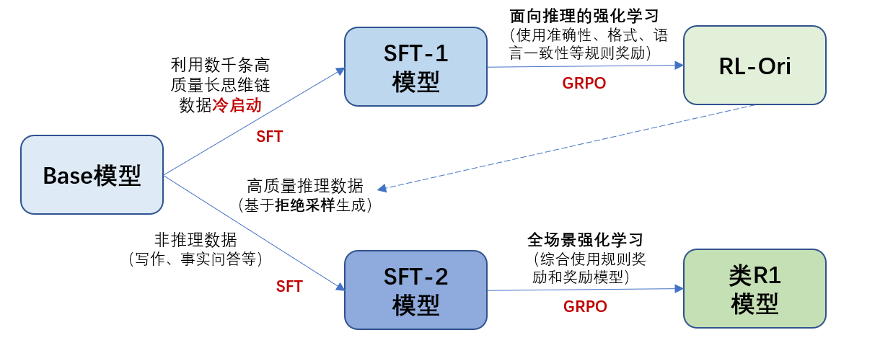

# DeepSeek-R1(qwen)
该特性是基于指令微调（SFT）、 GPRO 训练、拒绝采样、基于规则的打分器等基础特性综合实现的 R1 复现流程，可用于尝试复现 DeepSeek-R1 的工作。

## 整体流程示意图

R1 训练主要包含以下四个步骤：冷启动、面向推理的强化学习、拒绝采样及指令微调和全场景强化学习。下面详细介绍这四个步骤的具体过程：

### STEP 1 冷启动（Cold Start）
冷启动阶段的目的是用少量长思维链数据（long CoT data）来微调基座模型，作为第二步强化学习的起始点，增强了模型的可读性和性能潜力。因此，冷启动阶段直接使用微调脚本进行训练即可。
首先运行脚本对数据集进行处理，随后使用指令微调脚本进行冷启动阶段的微调，得到模型 SFT-1 。
这里以开源数据集 [OpenThoughts](https://huggingface.co/datasets/open-thoughts/OpenThoughts-114k)为例。

首先可以对数据集按照 R1 的输出格式进行处理，加入```<think>```和```<answer>```的标签。
``` python
import pandas
output_file = "./reason_cot_data.parquet"

dfs = [pandas.read_parquet('./OpenR1-Math-220k/extended/train-{:05d}-of-00007.parquet'.format(i)) for i in range(7)]

df = pandas.concat(dfs)
reannotated_assistant_content, problem = [], []
for i, c, o, a in zip(df['problem'], df['solution'], df['answer'], df['correctness_count']):
    if a == 2:
        problem.append(i)
        reannotated_assistant_content.append('<think>'+ c + '''</think>\n<answer>\\\\box{''' + o + '''}<answer>''')
pandas.DataFrame.from_dict({'problem':problem, 'reannotated_assistant_content':reannotated_assistant_content}).to_parquet(output_file)
```
随后进行权重转换、数据预处理和指令微调（相关部分的详细说明见 [**权重转换**](../../../../docs/features/checkpoint.md)、[**指令微调**](../../../../docs/features/instruction_finetune.md)
和 [**数据预处理**](../../../../docs/features/alpaca_dataset.md)）：
``` bash
# 进行权重转换
bash examples/mcore/deepseek_r1_recipes/r1/sft/convert_ckpt.sh
# 进行数据预处理
bash examples/mcore/deepseek_r1_recipes/r1/sft/preprocess_reason_cot_data.sh
# 进行冷启动指令微调 (注意修改数据路径、模型权重等)
bash examples/mcore/deepseek_r1_recipes/r1/sft/tune_qwen_7b.sh
```

### STEP 2 面向推理的强化学习（Reasoning-oriented Reinforcement Learning）
这一阶段与 R1-Zero 的训练过程基本相同，通过基于规则奖励的强化学习，来提升模型的推理能力。强化学习部分的配置说明和启动方式可以参考[**Zero对应部分**](../r1_zero/README.md)）。注意脚本内容要分步运行，即先完成 Ray 的初始化，再在主节点上拉起任务（这里给出的是单机 * 8卡的示例脚本）。
首先进行数据预处理
``` bash
bash examples/mcore/deepseek_r1_recipes/r1/rl_reason/preprocess_math_data.sh
```
主节点运行
``` bash
bash examples/mcore/deepseek_r1_recipes/r1/rl_reason/grpo_reason_master.sh
```

其余节点运行
``` bash
bash examples/mcore/deepseek_r1_recipes/r1/rl_reason/grpo_reason_worker.sh
```

### STEP 3 拒绝采样及指令微调（Rejection Sampling and Supervised Fine-Tuning）
本阶段主要利用上一阶段强化学习训练得到的模型来进一步生成指令微调数据，进行后续训练，提升模型在写作、角色扮演和其他通用任务中的能力。拒绝采样部分的详细说明请参照[**对应文档**](../r1/rejection_sampling.md)）
另外，这里还开源加入部分文科（通用）的带思维链的微调数据。
``` bash
# 1. 进行拒绝采样，生成数据
# 1.1 利用 vllm 进行数据生成
bash examples/mcore/deepseek_r1_recipes/r1/rejection_sampling/vllm_generate_qwen_7b.sh
# 1.2 通过规则及生成式奖励模型进行数据过滤
bash examples/mcore/deepseek_r1_recipes/r1/rejection_sampling/rejection_sampling_qwen_7b.sh
# 2. 进行数据预处理
bash examples/mcore/deepseek_r1_recipes/r1/rejection_sampling/preprocess_data.sh
# 3. 进行指令微调 (注意修改数据路径、模型权重等)
bash examples/mcore/deepseek_r1_recipes/r1/sft/tune_qwen_7b.sh
```


### STEP 4 全场景强化学习（Reinforcement Learning for all Scenarios）
这一阶段的强化学习在推理数据（reasoning data）之外，额外加入了通用数据，来提升模型的综合性能。对于推理数据，继续沿用 Zero 中的方法，采取基于规则的奖励；对于通用数据，由于不存在标准答案，因此还是使用 **奖励模型（reward model）** 来判断人类偏好。
在Zero的基础上，这里加入了在训练时使用混合数据集，并需要对数据集的类型做相应说明以便选取对应的奖励方式。

混合数据集的路径格式与预训练混合数据集相同，例如：
``` yaml
# 表示共包含 /cache/data/pe-nlp/data 和 /cache/data/firefly/data 两个数据集，按照权重 3:1 进行混合。
data_path: 3,/cache/data/pe-nlp/data,1,/cache/data/firefly/data

# 对上述数据集的类型进行说明，1 代表数学问题，使用打分器评分；0 代表通用问题，使用奖励模型评分。
dataset_category: 1,0
```
首先进行数据预处理
``` bash
bash examples/mcore/deepseek_r1_recipes/r1/rl_reason/preprocess_math_data.sh
bash examples/mcore/deepseek_r1_recipes/r1/rl_all/preprocess_general_data.sh
```

主节点运行
``` bash
bash examples/mcore/deepseek_r1_recipes/r1/rl_all/grpo_all_master.sh
```
其余节点运行
``` bash
bash examples/mcore/deepseek_r1_recipes/r1/rl_all/grpo_all_worker.sh
```

## VLLM接入、支持DeepSeek-V3-671B-R1复现
comming soon ... 